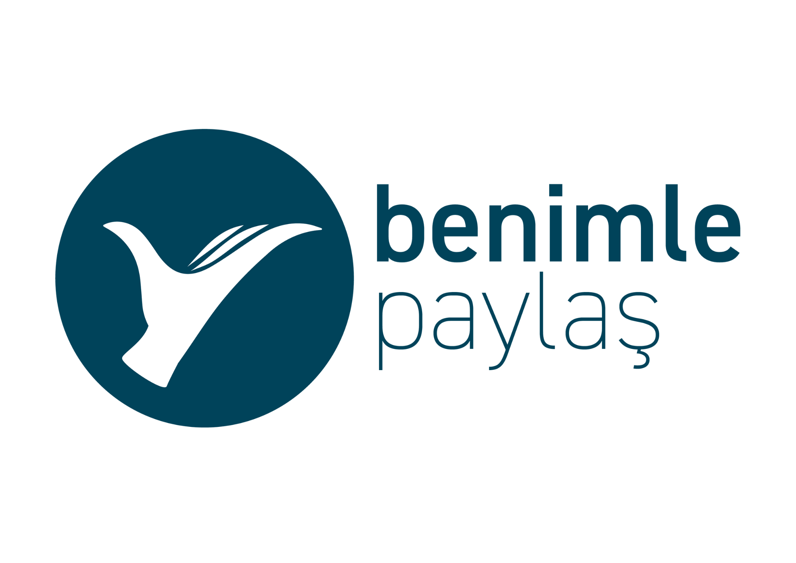

#  Psikolojik Destek Platformu



Bu proje, çevrim içi psikolojik danışmanlık hizmeti sunan bir web uygulamasıdır. Kullanıcılar kolayca randevu alabilir, hızlı destek formunu doldurabilir ve işaret dili destekli hizmetlerden faydalanabilir.

## Teknolojiler

- **HTML5**
- **CSS3**
- **Bootstrap 5**
- **JavaScript (Vanilla)**

## Özellikler

- 🌐 Duyarlı (responsive) tasarım
- 📞 İşaret diliyle destek hattı
- 🗓️ Online randevu alma sistemi
- 🔒 Güvenli ve gizli iletişim
- 👨‍⚕️ Psikolog ve danışan giriş bölümleri

## 📸 Ekran Görüntüsü


## 📁 Kurulum

Projeyi kendi bilgisayarında çalıştırmak için:

1. Bu repoyu klonlayın:
   ```bash
   [git clone [https://github.com/barzandavut/Benimle-Paylas]
   ```

2. Tarayıcıda açmak için:
   ```bash
   index.html dosyasını çift tıklayın veya bir canlı sunucuda çalıştırın.
   ```

## 📌 Notlar

- Bu proje örnek olarak geliştirilmiştir.
- Geliştirilmeye açıktır. Geri bildirimleriniz değerlidir.

## 🧑‍💻 Geliştirici

**Davut Çiftçi**  
- Psikoloji ve yazılım birleşimiyle insanlara teknolojik çözümler sunmayı amaçlıyorum.  
- [LinkedIn](https://www.linkedin.com/in/barzandavutciftci/) • [GitHub](https://github.com/barzandavut)
